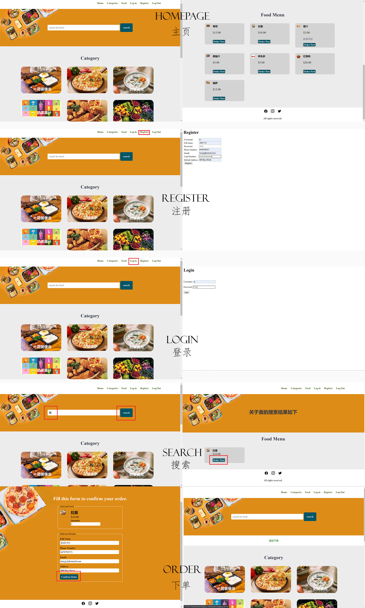
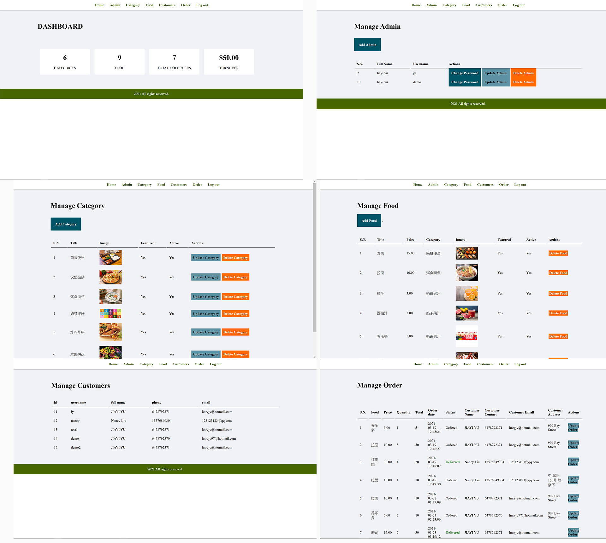
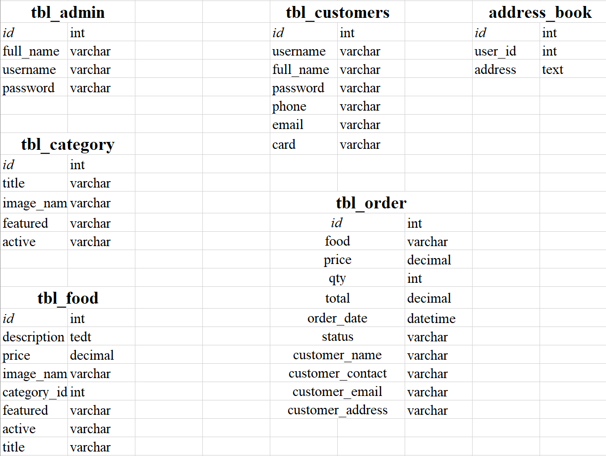

# food-order-project
 

<!-- TABLE OF CONTENTS -->

  
Table of Contents

  <ol>
    <li>
      <a href="#about-the-project">About The Project</a>
      <ul>
        <li><a href="#built-with">Built With</a></li>
      </ul>
    </li>
    <li>
      <a href="#visual-showcase">Visual Showcase</a>
      <ul>
        <li><a href="#Video">Video Walk-through</a></li>
      </ul>
    </li>
    <li><a href="#database">Database</a></li>
    <li><a href="#contact">Contact</a></li>
    <li><a href="#acknowledgements">Acknowledgements</a></li>
  </ol>

<!-- ABOUT THE PROJECT -->
## About The Project
  My first intention for this project was to do something that could showcase my SQL skillsets. I found out that by just displaying a few tables in the database, it would be too hard and abstract for the readers to comprehend what's going on. Therefore, with the help of PHP programming languages, a website would be accessible and understandable.
  
  
  Here's an short overview of the project:
  *	A food order website implemented by PHP and MySQL, which is composed of two parts: the frontend and the backend.
  *	Build a client-facing frontend that shows available food in a variety of categories. It also enables registered customers to place orders.
  *	The backend would be used by admins to manage food, category, registered customers and orders.
  *	All the data above would be stored in the database in MySQL.

### Built With

Major frameworks that I built my project using:
* [PHP](https://www.php.net/)
* [MySQL](https://www.mysql.com/)
* [phpMyAdmin](https://www.phpmyadmin.net/)

<!-- VISUAL SHOWCASE -->
## Visual Showcase
  Compared to brief in long words, I think it would be more understandable to show visually. So I include the link of the video and some screenshots below.

### Video Walk-through
  * [Video Link](https://www.bilibili.com/video/bv1KB4y1P7vY)

### Screenshot
  Here's the frontend: 
  

  Here's the backend: 
  

<!-- DATABASE -->
## Database
  Here's a list of tables for the databse called restaurant, which is the fundamental component of this project.
  
  

<!-- CONTACT -->
## Contact

Jiayi Yu - yu.jiayi@mail.utoronto.ca

Project Link: [https://github.com/jyyy750/food-order-project](https://github.com/jyyy750/food-order-project)

<!-- ACKNOWLEDGEMENTS -->
## Acknowledgements
* [README-Template](https://github.com/othneildrew/Best-README-Template/blob/master/README.md#about-the-project)
* [MYSQL-Documentation](https://www.w3school.com.cn/sql/index.asp)
* [CSS tutorial](https://www.w3school.com.cn/css/index.asp)
* [PHP tutorial](https://www.w3school.com.cn/php/index.asp)

